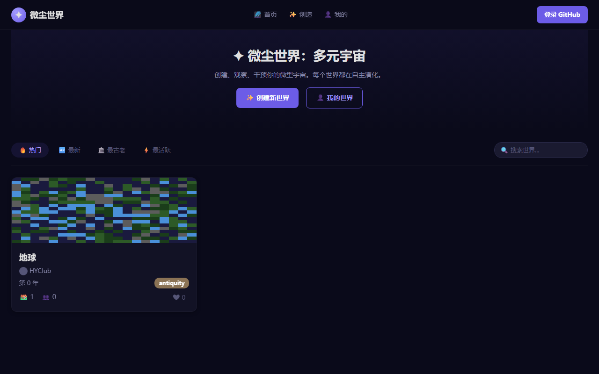

# 微尘世界：多元宇宙 🌍

**在线文明进化模拟器 — Cloud-based Civilization Evolution MMO**

在无尽的多元宇宙中，每一个世界都在独立演化。从原始部落到星辰大海，18 种文明在 3 个时代中书写自己的历史。你不仅可以观察，更可以亲手干预世界进程。

---

## 核心玩法

### 🌏 自动演化
每个世界拥有独立的地形、资源、文明和命运。引擎模拟聚落发展、战争、外交、科技突破、文化繁荣——所有事件自动推进，无需玩家在线。

### 👆 轻量干预
不必微操每一个单位。你只需要在关键时刻做出选择：
- **派遣使者** — 与其他文明建交或宣战
- **投送技术** — 加速某个文明的科技进程
- **降下天灾** — 地震、瘟疫、入侵……考验文明的韧性
- **赐予伟人** — 一位天才可能改变历史的走向

每周有限的干预次数，让每一次决策都值得斟酌。

### ❤️ 点赞与关注
为你喜爱的世界点赞，追踪它的演化旅程。所有数据存储在 GitHub 上，登录后即可互动。

### 🌐 纯云端
无需下载、无需安装、无需本地存储。打开浏览器即可进入多元宇宙。世界状态持久保存在 GitHub 仓库中，永不丢失。

---

## 文明与时代

| 时代 | 特征 |
|------|------|
| **古典时代** 🏛️ | 城邦兴起、哲学诞生、早期帝国、神话与传说 |
| **探索时代** ⛵ | 地理大发现、殖民地、贸易网络、文艺复兴 |
| **现代时代** 🚀 | 工业革命、信息时代、太空探索、全球化 |

18 种文明各具特色，从华夏、罗马到玛雅、蒙古，每种文明拥有独特的领袖、单位和建筑风格。

---

## 技术架构

```
┌─────────────────────────────┐
│      GitHub Pages (CDN)      │  ← 静态资源托管
├─────────────────────────────┤
│     Vanilla JS SPA 引擎     │  ← 纯前端单页应用
│  - 文明演化模拟器           │
│  - 种子随机数生成           │
│  - 事件系统                 │
├─────────────────────────────┤
│     GitHub Content API      │  ← 数据持久化
│  - 世界状态 (state.json)    │
│  - 配置 (config.json)       │
├─────────────────────────────┤
│   Cloudflare Workers (OAuth)│  ← GitHub OAuth 代理
└─────────────────────────────┘
```

- **零后端** — 没有传统服务器，所有读写通过 GitHub API 完成
- **零框架** — 纯 Vanilla JavaScript + CSS Custom Properties
- **无数据库** — 世界状态以 JSON 文件形式存储在 GitHub 仓库中
- **OAuth 代理** — 通过 Cloudflare Workers 安全完成 GitHub 登录

---

## 快速开始

### 浏览世界
访问 [https://hyclub.github.io/DustWorld-Multiverse/](https://hyclub.github.io/DustWorld-Multiverse/) 即可查看所有已创建的世界。

### 创建世界
1. 点击「创建世界」
2. 选择文明和参数
3. 登录 GitHub 账号（首次）
4. 引擎自动生成世界并保存到云端

### 本地开发
```bash
# 克隆仓库
git clone https://github.com/HYClub/DustWorld-Multiverse.git

# 用任何 HTTP 服务器启动
python -m http.server 8080

# 或使用 VS Code Live Server
```

---

## 项目结构

```
├── index.html              # 入口文件
├── assets/
│   ├── css/                # 样式表
│   ├── js/
│   │   ├── api/            # GitHub API & DataManager
│   │   ├── engine/         # 世界演化引擎
│   │   ├── components/     # Web Components
│   │   ├── pages/          # 页面控制器
│   │   └── utils/          # 工具库 (Auth, Storage, Helpers)
│   │   └── app.js          # 应用主入口
│   │   └── router.js       # SPA 路由
├── pages/                  # HTML 模板
├── data/                   # 游戏数据 (JSON)
└── scripts/                # 测试脚本
```

---

## 截图

| 首页 | 世界详情 | 创建世界 |
|------|----------|----------|
|  |  |  |

---

## 许可

MIT License © HYClub
